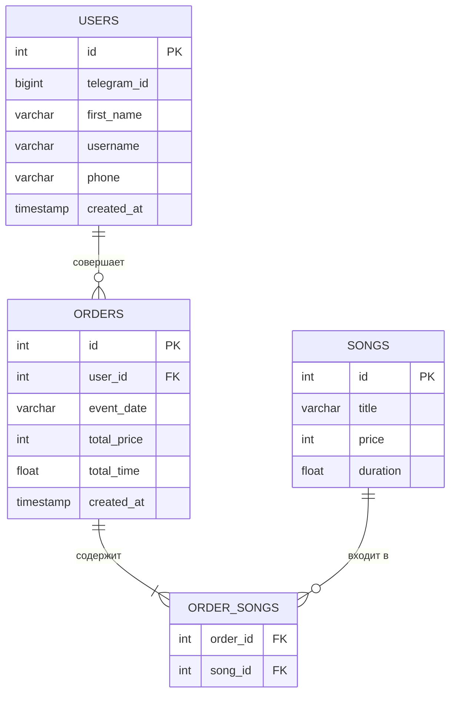

## ER-диаграмма базы данных проекта

Ниже представлена схема базы данных бота, описывающая связи между клиентами, заказами и песнями.

```mermaid
erDiagram
    USERS ||--o{ ORDERS : "совершает"
    ORDERS ||--|{ ORDER_SONGS : "содержит"
    SONGS ||--o{ ORDER_SONGS : "входит в"

    USERS {
        int id PK
        bigint telegram_id
        varchar first_name
        varchar username
        varchar phone
        timestamp created_at
    }

    ORDERS {
        int id PK
        int user_id FK
        varchar event_date
        int total_price
        float total_time
        timestamp created_at
    }

    SONGS {
        int id PK
        varchar title
        int price
        float duration
    }

    ORDER_SONGS {
        int order_id FK
        int song_id FK
    }
```